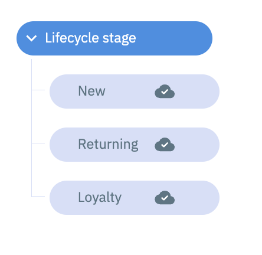
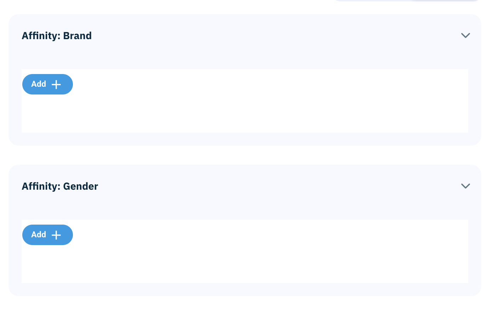
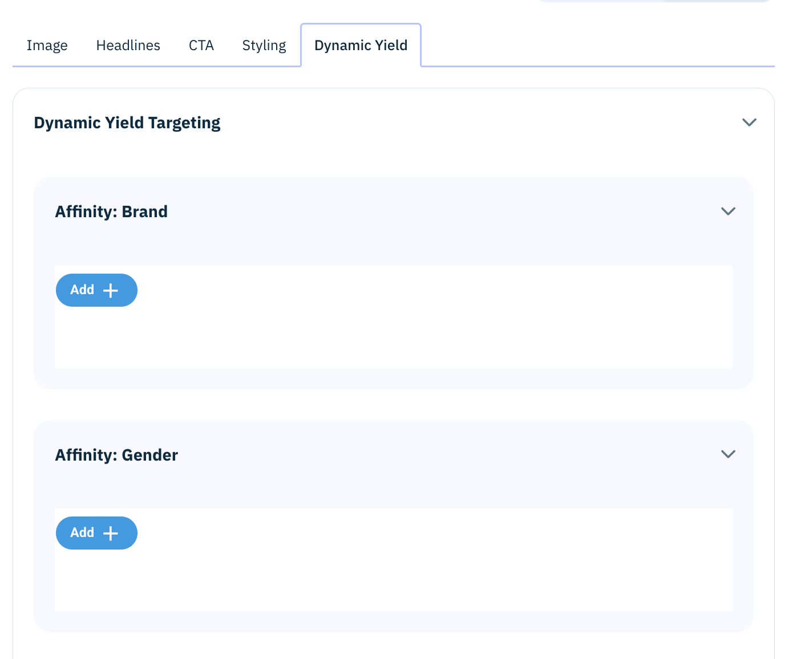
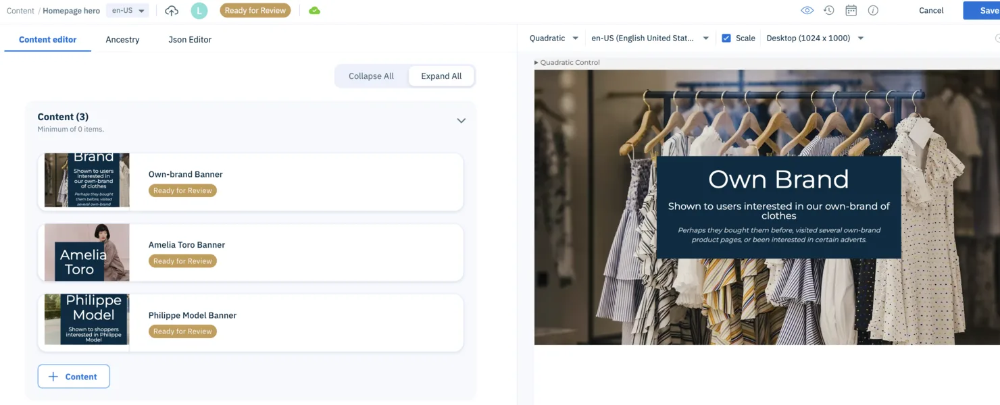

# Amplience and Dynamic Yield affinity schema starter

[](https://github.com/amplience/dynamic-yield-affinity-integration/actions/workflows/ci.yml)

This repository is a reference set of Amplience Dynamic Content schemas for
attaching Dynamic Yield affinity and targeting metadata to content. It provides
an authoring model, not an end-to-end personalization runtime.

The three included targeting dimensions—brand affinity, gender affinity, and
lifecycle stage—are illustrative. Adapt them to the attributes and exact values
available in your Dynamic Yield profile configuration.

## What is included

- A hierarchy root content type for each targeting dimension.
- A hierarchy leaf content type with separate author-facing `label` and stable
  machine-facing `value` fields.
- A reusable targeting partial that selects leaves with the Amplience hierarchy
  chooser extension.
- A standalone example banner that references the targeting partial.
- A content container that links candidate banners for a placement.
- Local and CI validation for schemas, fixtures, documentation, and public-repo
  hygiene.

The schema relationships are:

```text
affinity-group
└── affinity-value
        ▲
        │ selected by targeting partial
        │
example-banner ── uses targeting partial
        ▲
        │ linked as a candidate
content-container
```

## Runtime boundary

This starter does not retrieve a Dynamic Yield profile, run a campaign, score
content, select a winner, or render a fallback. Your application or integration
must:

1. Retrieve the visitor's affinity data from an appropriate Dynamic Yield API.
2. Retrieve the candidate content and its inlined targeting values from
   Amplience.
3. Define exact matching, score thresholds, tie-breaking, ordering, and fallback
   behavior.
4. Render the selected content and handle API errors, consent, and caching.

Dynamic Yield exposes client-side affinity data through
[`DY.ServerUtil.getUserAffinities()`](https://dy.dev/reference/affinity-client-side)
and server-side affinity data through
[Profile Anywhere](https://dy.dev/reference/profileanywhere). Choose the API and
identity model that fit your implementation; this repository calls neither API
and contains no credentials.

## Prerequisites

- An Amplience Dynamic Content hub with permission to create schemas, register
  content types and extensions, and create and publish content.
- Dynamic Yield Experience OS and a confirmed list of affinity or targeting
  dimensions and values for your implementation.
- Content Delivery v2 provisioned and enabled on the Amplience hub if you use the
  verification request shown below.
- Node.js 22 and npm only if you want to run the repository checks locally.

## Schema IDs

The schemas use the example namespace
`https://schema-examples.com/dynamic-yield-affinity-integration/`. You can use
the IDs unchanged for evaluation. For production, you may replace the namespace
with one you control, but every `$id`, `$ref`, hierarchy child type, and content
type enum must be updated consistently.

## Set up Amplience

### 1. Register the hierarchy chooser

In **Developer > Extensions** in your Amplience hub, register the
[Amplience hierarchy chooser](https://github.com/amplience/dc-extension-hierarchy-chooser)
with these settings:

| Setting            | Value                                                        |
| ------------------ | ------------------------------------------------------------ |
| Category           | Content Field                                                |
| Name               | `hierarchy-chooser`                                          |
| URL                | `https://hierarchy-chooser.extensions.content.amplience.net` |
| API permission     | Read access                                                  |
| Sandbox permission | Allow same origin                                            |

The `name` must match the `ui:extension.name` values in
[`targeting.json`](content-type-schemas/partials/targeting.json). If your hub
uses a different unique name, update all three occurrences in that schema.

### 2. Add the schemas

Add the files from [`content-type-schemas/`](content-type-schemas/) in dependency
order:

1. [`affinity-value.json`](content-type-schemas/affinity-value.json) as a content
   type schema, then register or sync its content type.
2. [`affinity-group.json`](content-type-schemas/affinity-group.json) as a content
   type schema, then register or sync its content type.
3. [`targeting.json`](content-type-schemas/partials/targeting.json) as a partial.
   Do not register it as a content type.
4. [`example-banner.json`](content-type-schemas/example-banner.json) as a content
   type schema, then register or sync its content type.
5. [`content-container.json`](content-type-schemas/content-container.json) as a
   content type schema, then register or sync its content type.

Amplience supports JSON Schema draft 7 for content type schemas. A partial is a
definitions-only schema and must be synced into each content type that references
it after the partial changes.

### 3. Create the targeting hierarchies

Create and publish one `Dynamic Yield affinity group` root for each included
dimension. Assign these delivery keys to the roots:

| Dimension       | Root delivery key                         |
| --------------- | ----------------------------------------- |
| Brand affinity  | `dynamic-yield/affinities/brand`          |
| Gender affinity | `dynamic-yield/affinities/gender`         |
| Lifecycle stage | `dynamic-yield/targeting/lifecycle-stage` |

Under each root, create and publish `Dynamic Yield affinity value` children. Use
`label` for the name authors should see and `value` for the stable token your
runtime will compare with Dynamic Yield data. Matching should use `value`, not
`label`, and should follow the spelling and case rules you define for the
integration.



_Illustrative authoring data; configure values to match your Dynamic Yield
profile._

The targeting partial looks up each root by delivery key, avoiding
tenant-specific node IDs. The hierarchy chooser supports either a delivery key
or a node ID and gives the delivery key precedence when both are supplied.



_The Amplience interface can vary by account and product release._

### 4. Add targeting to your content

The included banner is deliberately small and uses only Amplience core content
and image links. Use it to test the setup, or copy its `targeting` property into
your own content type and sync that content type after the change.

Targeting is optional in the example so an untargeted item can serve as a
fallback if your runtime chooses that convention.



_This source screenshot shows a customer-specific banner form; the portable
example schema in this repository has fewer fields._

### 5. Configure a candidate container

The content container requires at least one candidate and currently accepts only
the included example banner. To use your own types, replace or extend the
`contentType.enum` in
[`content-container.json`](content-type-schemas/content-container.json), then
sync the content type.

Create, save, and publish a container with the candidate content for one
placement.



_The preview and content fields in this source screenshot are tenant-specific._

### 6. Verify delivered content

With Amplience Content Delivery v2 enabled, retrieve the published container by
delivery key or delivery ID and inline its dependency tree:

```text
https://{hubname}.cdn.content.amplience.net/content/key/{container-key}?depth=all&format=inlined
```

Confirm that the response contains each candidate and the selected affinity
items, including their `label` and `value`. The `depth=all` parameter retrieves
the dependency tree and `format=inlined` returns it as an inlined content tree.

Before releasing or deploying an adapted schema set, complete the
[non-production smoke test](docs/smoke-test.md).

## Adaptation notes

- Treat the supplied dimensions and root delivery keys as examples, not as a
  promise that the same attributes exist in every Dynamic Yield account.
- Keep machine values stable. Authors can update labels without changing runtime
  matching behavior.
- Decide whether matching is case-sensitive and normalize both sources if it is
  not.
- Define behavior for missing profiles, empty targeting, multiple matches, equal
  scores, and stale or unpublished linked content.
- Keep personal data and credentials out of Amplience content and this
  repository.

## Local validation

Install the pinned development dependencies and run the same checks as CI:

```bash
npm ci
npm run lint
npm test
```

The tests validate all schemas against JSON Schema draft 7 with a local model of
the documented Amplience core definitions. They also compile cross-schema
references, exercise valid and invalid content fixtures, check local Markdown
links, and scan for common private-repository residue.

## Documentation basis

The schemas and setup steps were checked against:

- [Amplience: JSON Schema](https://amplience.com/developers/docs/schema-reference/json-schema/)
- [Amplience: Mixins and partials](https://amplience.com/developers/docs/schema-reference/mixins/)
- [Amplience: Traits](https://amplience.com/developers/docs/schema-reference/traits/)
- [Amplience: Content relationships](https://amplience.com/developers/docs/concepts/relationships/)
- [Amplience: HTTP Content Delivery](https://amplience.com/developers/docs/apis/content-delivery/content-delivery-overview/)
- [Amplience hierarchy chooser](https://github.com/amplience/dc-extension-hierarchy-chooser)
- [Dynamic Yield: client-side affinity API](https://dy.dev/reference/affinity-client-side)
- [Dynamic Yield: Profile Anywhere](https://dy.dev/reference/profileanywhere)

## Contributing, security, and license

See [CONTRIBUTING.md](CONTRIBUTING.md) before opening a pull request. Report
security vulnerabilities as described in [SECURITY.md](SECURITY.md), not in a
public issue.

Licensed under the [Apache License 2.0](LICENSE).
